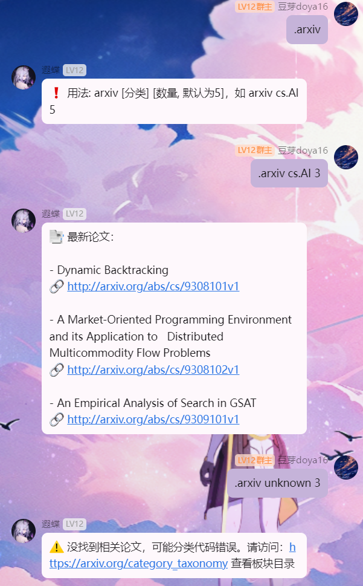

# Nonebot-Plugin  Arxiv Paper Search

🔍 基于 [NoneBot2](https://v2.nonebot.dev/) 的插件，支持从 arXiv 获取指定分类的最新论文摘要，适用于科研讨论群、AI/ML 技术交流群等。

---

## 🖼 使用示例

以下是在 QQ 群中发送 `.arxiv cs.AI 3` 后的返回示例：



---

## ✨ 功能特色

- 🧠 查询最新 arXiv 论文，支持所有板块
- 📚 支持 `.arxiv list` 查看推荐分类

---

## 🛠 安装与使用

### 插件安装

将插件文件 `ArxivList.py` 放入你的 NoneBot 插件目录（如 `plugins/arxiv_digest/__init__.py`）：

```bash
mkdir -p plugins/arxiv_digest
cp ArxivList.py plugins/arxiv_digest/__init__.py
```

### 依赖安装

```bash
pip install nonebot2[fastapi] nonebot-adapter-onebot httpx
```

---

## 📦 指令说明

| 指令示例            | 说明                       |
|---------------------|----------------------------|
| `.arxiv cs.LG 5`     | 获取 cs.LG 类别的 5 篇最新论文 |
| `.arxiv list`        | 查看推荐板块分类列表          |
| `.公告 你的内容`     | 管理员指令，向所有群广播公告     |

---

## 📚 推荐分类列表

| 分类代码 | 中文描述 |
|----------|-----------|
| cs.AI    | 人工智能 |
| cs.CL    | 计算语言学 |
| cs.CV    | 计算机视觉 |
| cs.LG    | 机器学习 |
| stat.ML  | 统计机器学习 |
| cs.RO    | 机器人 |
| cs.CR    | 密码学与安全 |
| cs.NI    | 网络与互联网架构 |

查看更多板块请访问 👉 [arXiv 分类](https://arxiv.org/category_taxonomy)


---

## 📃 License

本项目基于 MIT 协议开源，欢迎自由使用与修改。
